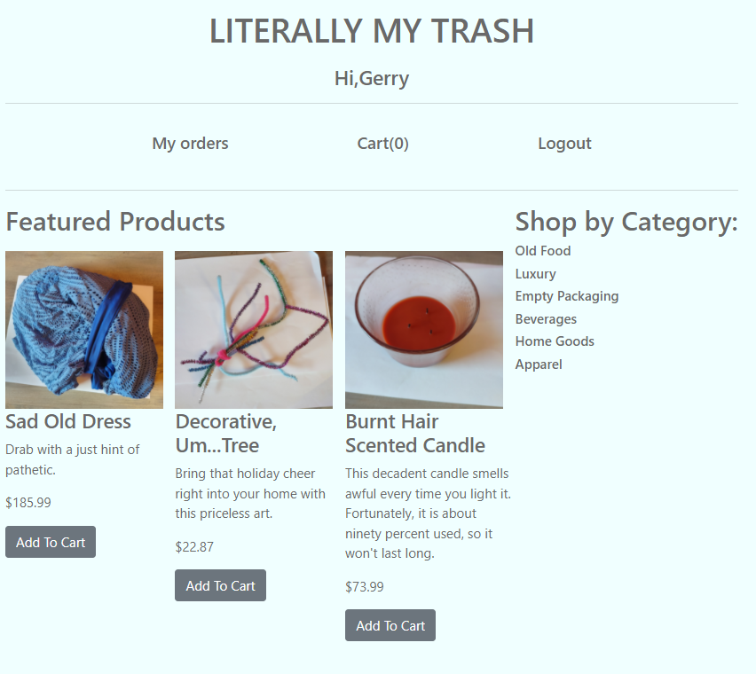

# Literally My Trash

This is a humorous shopping site that allows users to browse my actual garbage. 
Users may create an account, add items to a cart, make a mock purchase, and leave reviews. 

I created this project because I wanted to see what it was like to build a shopping cart from scratch 
in Django Models. For the most part, it functions very well. I am constantly researching and updating it. 

User and registration pages contain regex vailation and display useful erors for invalid data. Users can 
manage orders as well as their product reviews.

Deployed to AWS EC2. Images hosted on AWS s3.

Built with:
  Python
  Django
  HTML

Django Dependancies:
  Pillow
  Django-Storages
  Boto3
  Bcrypt
 

